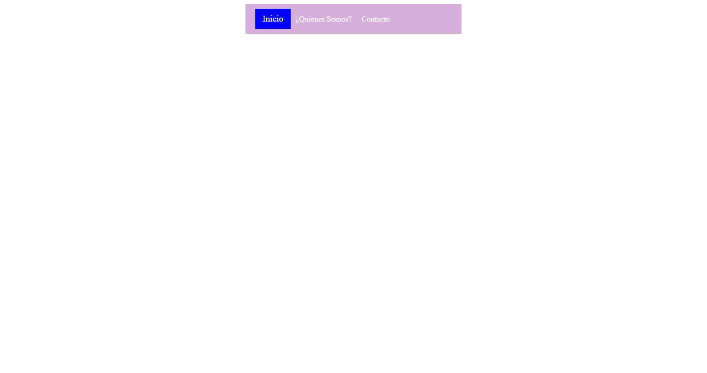

<h1>Taller 9: Kevin Alejandro Pedraza Diaz</h1>

<h2>Información</h2>

Curso: Full Stack Basico - Grupo 1

Profesor Cristian Patiño

<h2>Pregunta 1: Link de Figma</h2>
<a href="https://www.figma.com/file/Y6zhOH1la71AMl0BReDsRi/Untitled?type=design&node-id=0-1&t=3Ax9I2yg0AlfaDSH-0">Link de Figma</a>

 
<a href="https://ryuubehemoth.github.io/Taller-9-Full-Stack/">Link Pagina</a>

<h2>Punto 2: HTML</h2>

<h2>Punto 3: CSS</h2>

<h2>Punto 4: HTML y CSS</h2>

<h2>Punto 5: HTML y CSS</h2>

<h2>Punto 6: HTML y CSS</h2>

<h2>Punto 7-8: HTML y CSS</h2>

<h2>Punto 9: HTML y CSS</h2>
